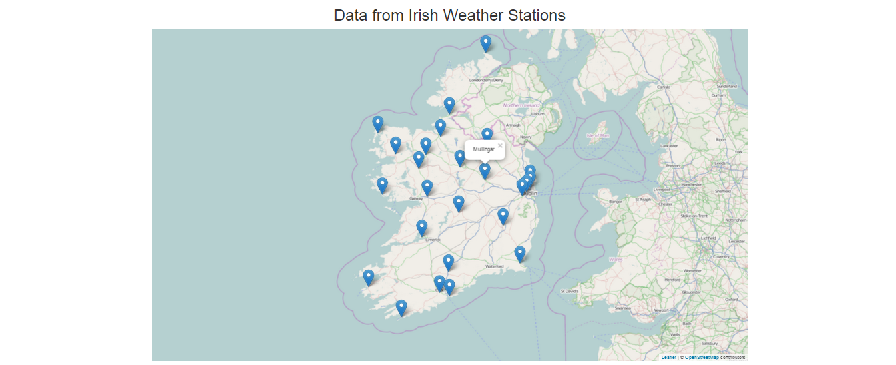
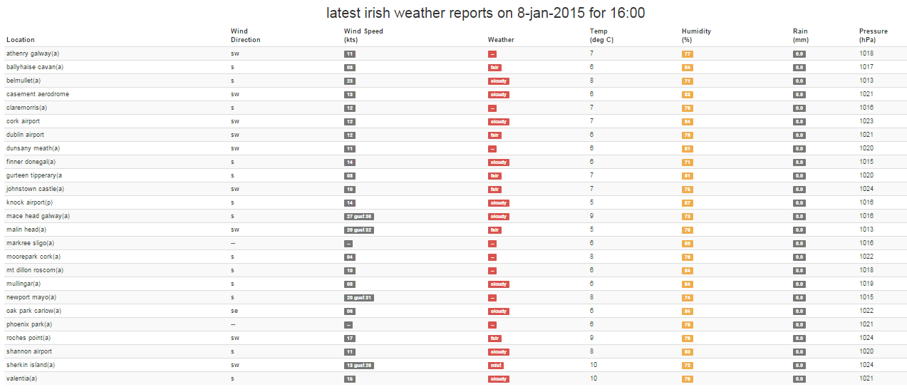

## Scraping Irish Weather Data

### Why?

I was unable to find an API that would retrieve current weather data from the numerous weather stations throughout the country.
The [Met Eireann web site](http://www.met.ie) hosts a table containing weather station data that is updated approximately every hour.

### App Functionality

I scraped the weather station data from [this table](http://www.met.ie/latest/reports.asp) with the help of [Node](http://nodejs.org/) and [cheerio](https://github.com/cheeriojs/cheerio).

The Node server polls the [Met Eireann site](http://www.met.ie/latest/reports.asp) at intervals for data.

Weather station data is send to an Angular client via [socket.io](http://socket.io/).

The client renders a map in the browser with the help of [leafletJS](http://leafletjs.com/). The map displays the locations of the weather stations. Tabular weather data for each station is also rendered in the view.

The data for the map is contained in [Geo JSON](http://geojson.org/) format inside an Angular service.
[Geo JSON](http://geojson.org/) is a JSON format specifically designed for geographic applications.

### Main Technologies Used

- [NodeJS](http://nodejs.org/)
- [ExpressJS](http://expressjs.com/) 
- [AngularJS](https://angularjs.org/)
- [Socket.io](socket.io)
- [BT Ford's socket.io Angular Module](https://github.com/btford/angular-socket-io)
- [Simplified HTTP request client](https://github.com/request/request)
- [Cheerio](https://github.com/cheeriojs/cheerio)
- [Geo JSON](http://geojson.org/)
- [LeafletJS](http://leafletjs.com/)

### Running the App

- clone the repository
- npm install
- bower install
- node server.js
- browse to _http://localhost:3000/_

## Screen Shots

		

		

Michael Cullen 2015
